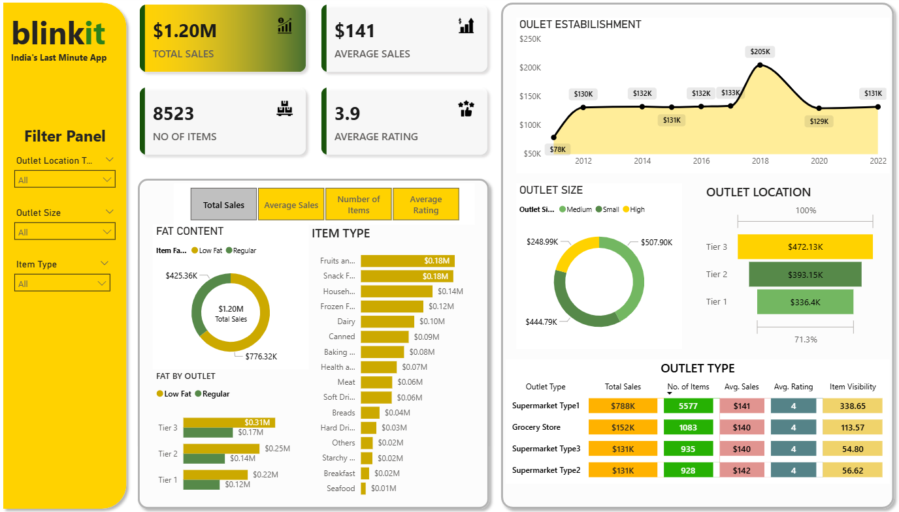
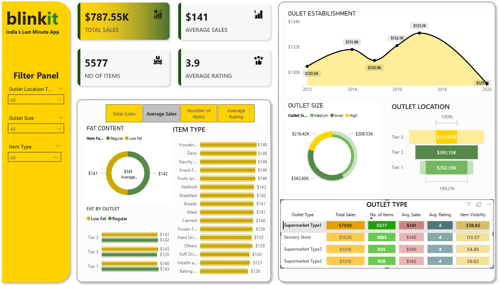
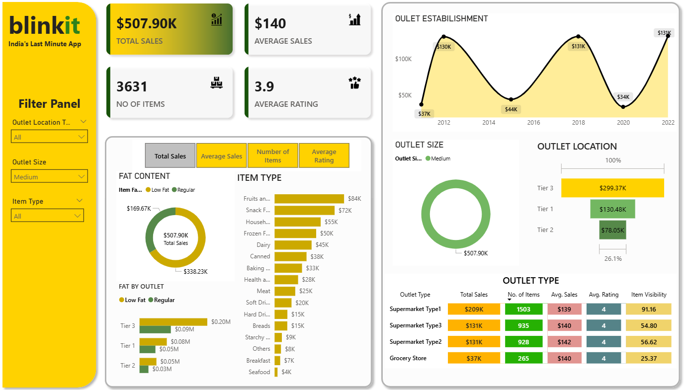

### Definitions of Columns
*   **`Item Fat Content`** - Indicates if the product is low-fat or regular. (Values: Low Fat, Regular, LF, etc.).
*   **`Item Identifier`** - A unique ID code for each product.
*   **`Item Type`** - The category of the product (e.g., Fruits, Snacks, Dairy).
*   **`Outlet Establishment Year`** - The year the store was opened.
*   **`Outlet Identifier`** - A unique ID code for each store.
*   **`Outlet Location Type`** - The tier of the city where the store is located (Tier 1, 2, or 3).
*   **`Outlet Size`** - The physical size of the store (Small, Medium, High).
*   **`Outlet Type`** - The format of the grocery store (e.g., Grocery Store, Supermarket Type1).
*   **`Item Visibility`** - The percentage of display area allocated to the product in the store.
*   **`Item Weight`** - The weight of the product (has some missing values).
*   **`Sales`** - The sales amount for the product at that store.
*   **`Rating`** - A rating given to the product.

### Screenshots
Below I provide Screenshots:

